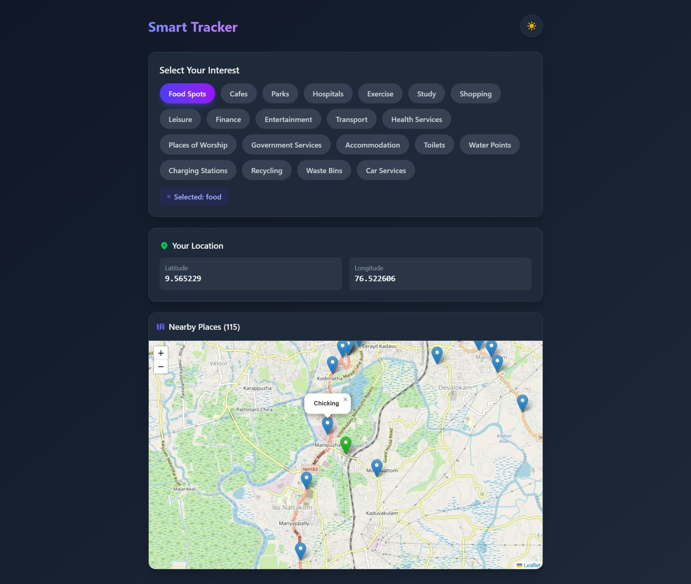

# Smart Tracker

> **Note:** This is a working prototype. The final application will be an enhanced version with additional features and improvements.

A location-based Points of Interest (POI) finder that helps you discover nearby places based on your interests. Built with React, Leaflet, and Express.js.

## Screenshot



> **Note:** 🟢: Your Location.
> 🔵: Point of Interest.
## Features

- **Geolocation**: Automatically detects your current location
- **Interest Categories**: Find nearby food spots, cafes, parks, or hospitals
- **Interactive Map**: View places on a Leaflet-powered map
- **Dark Mode**: Toggle between light and dark themes
- **Real-time Search**: Fetches nearby places from OpenStreetMap data via Overpass API

## Tech Stack

### Frontend
- React 19
- Vite
- Tailwind CSS
- Leaflet / React-Leaflet

### Backend
- Node.js
- Express.js
- Overpass API (OpenStreetMap)

## Getting Started

### Prerequisites

- Node.js (v18 or higher recommended)
- npm or yarn

### Installation

1. **Clone the repository**
   ```bash
   git clone <repository-url>
   cd smart-tracker
   ```

2. **Install backend dependencies**
   ```bash
   cd backend
   npm install
   ```

3. **Install frontend dependencies**
   ```bash
   cd ../frontend
   npm install
   ```

### Running the Application

1. **Start the backend server**
   ```bash
   cd backend
   npm run dev
   ```
   The server will run on `http://localhost:3000`

2. **Start the frontend development server**
   ```bash
   cd frontend
   npm run dev
   ```
   The app will open in your browser (typically at `http://localhost:5173`)

## Project Structure

```
smart-tracker/
├── backend/
│   ├── index.js              # Express server entry point
│   ├── routes/
│   │   └── place.js          # Place search route
│   └── services/
│       ├── interestMap.js    # Interest to OSM tag mappings
│       └── overpass.js       # Overpass API integration
├── frontend/
│   ├── src/
│   │   ├── App.jsx           # Main application component
│   │   ├── main.jsx          # React entry point
│   │   └── components/
│   │       └── MapView.jsx   # Leaflet map component
│   ├── hooks/
│   │   └── locations.js      # Geolocation hook
│   └── services/
│       ├── leaflet.js        # Leaflet configuration
│       └── service.js        # Interest categories
└── README.md
```

## API Endpoints

### GET /place

Fetches nearby places based on location and interest.

**Query Parameters:**
| Parameter | Type   | Description              |
|-----------|--------|--------------------------|
| lat       | number | Latitude coordinate      |
| lng       | number | Longitude coordinate     |
| interest  | string | Category of interest     |

**Supported Interests:**
- `food` - Restaurants, fast food, cafes
- `cafe` - Coffee shops and cafes
- `park` - Parks and recreational areas
- `hospital` - Hospitals and medical facilities
- `exercise` - Gyms, sports centres, swimming pools
- `study` - Libraries, colleges, universities, schools
- `shopping` - Supermarkets, malls, convenience and specialty stores
- `leisure` - Playgrounds, gardens, pitches, nature reserves, water parks
- `finance` - Banks, ATMs, currency exchange
- `entertainment` - Cinemas, theatres, nightclubs, arts centres, casinos
- `transport` - Bus stations, taxi stands, ferries, rentals, parking, fuel, charging
- `health` - Clinics, pharmacies, dentists, doctors, veterinary
- `worship` - Churches, mosques, synagogues, temples
- `government` - Town halls, courthouses, police, fire stations, post offices, embassies
- `accommodation` - Hotels, hostels, motels, guest houses, apartments, campsites
- `toilet` - Public toilets
- `water` - Drinking water, fountains, water points, showers
- `charging` - EV charging stations
- `recycling` - Recycling points
- `waste` - Waste bins
- `car` - Car wash, rentals, sharing, fuel, parking

**Example:**
```
GET /place?lat=40.7128&lng=-74.0060&interest=food
```

## License

ISC
